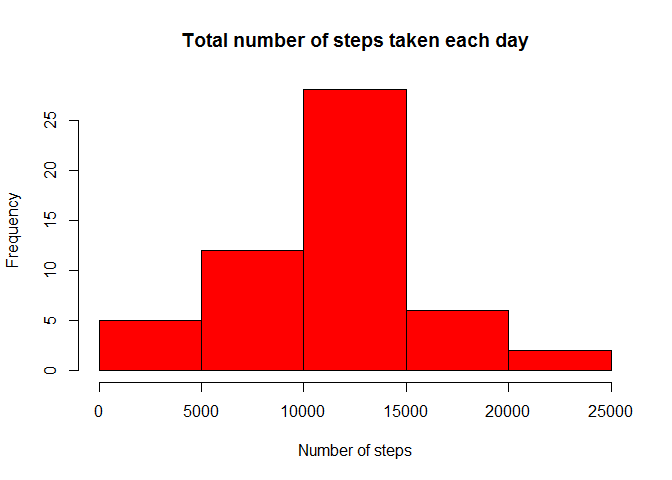
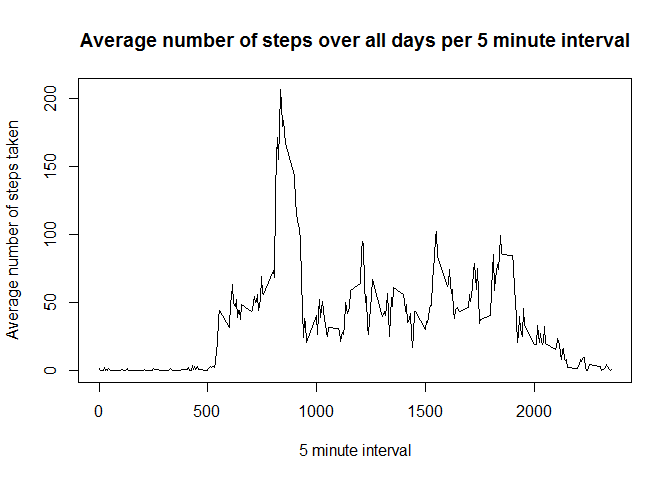
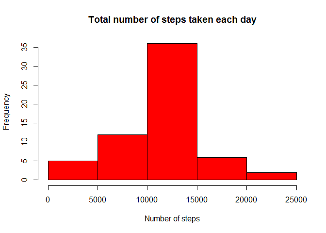

# Reproducible Research: Peer Assessment 1


## Loading and preprocessing the data
First, set working directory to unzipped folder repdata-data-activity 
which is available on https://d396qusza40orc.cloudfront.net/repdata%2Fdata%2Factivity.zip)

Load the data

```r
activity <- read.csv("activity.csv")
```

remove NAs

```r
complete_activity <- na.omit(activity)
```

Load dplyr package (if not installed install by install.packages("dplyr")), lubridate package and ggplot2 packages

```r
library(dplyr)
```

```
## Warning: package 'dplyr' was built under R version 3.2.2
```

```
## 
## Attaching package: 'dplyr'
```

```
## The following objects are masked from 'package:stats':
## 
##     filter, lag
```

```
## The following objects are masked from 'package:base':
## 
##     intersect, setdiff, setequal, union
```

```r
library (lubridate)
```

```
## Warning: package 'lubridate' was built under R version 3.2.2
```

```r
library(ggplot2)
```

```
## Warning: package 'ggplot2' was built under R version 3.2.2
```

## What is mean total number of steps taken per day?
Calculate the total number of steps taken per day
As illustration, the top of the dataset with total steps per day is shown (function head).

```r
activity_per_day <- summarise(group_by(complete_activity, date), sum(steps))
head(activity_per_day)
```

```
## Source: local data frame [6 x 2]
## 
##         date sum(steps)
##       (fctr)      (int)
## 1 2012-10-02        126
## 2 2012-10-03      11352
## 3 2012-10-04      12116
## 4 2012-10-05      13294
## 5 2012-10-06      15420
## 6 2012-10-07      11015
```

Make a histogram of the total number of steps taken each day

```r
hist(activity_per_day$`sum(steps)`, col = "red", 
     main = "Total number of steps taken each day", xlab = "Number of steps")
```

\

Calculate and report the mean and median of the total number of steps taken 
per day

```r
mean(activity_per_day$`sum(steps)`)
```

```
## [1] 10766.19
```

```r
median(activity_per_day$`sum(steps)`)
```

```
## [1] 10765
```
The mean is 10766.19
The median is 10765

## What is the average daily activity pattern?
Plot the 5-minute interval (x-axis) and the average number of steps taken, 
averaged across all days (y-axis)

```r
daily_pattern <- aggregate(steps ~ interval, 
                           data = activity, 
                           FUN = mean)
plot(x = daily_pattern$interval, 
     y = daily_pattern$steps,
     xlab = "5 minute interval", 
     ylab = "Average number of steps taken",
     main = "Average number of steps over all days per 5 minute interval",
     type = "l")
```

\

Which 5-minute interval, on average across all the days in the dataset, 
contains the maximum number of steps?

```r
id_maximalsteps <- which.max(daily_pattern$steps)
daily_pattern[id_maximalsteps,]
```

```
##     interval    steps
## 104      835 206.1698
```
The 5-minute interval 835 contains the maximum number of steps.


## Imputing missing values
Calculate and report the total number of missing values in the dataset

```r
sum(is.na(activity$steps))
```

```
## [1] 2304
```
The total number of rows with NAs is 2304

Devise a strategy for filling in all of the missing values in the dataset
Strategy will be to impute the missing data with the average number of steps
in that 5 minute interval

create logical vector indicating positions of NA values (TRUE)

```r
na <- is.na(activity$steps)
```

create vectorr with the mean every 5 minutes

```r
vector_one_day <- c(daily_pattern[1:288,2])
```

replicate this for the total number of days

```r
vector_all_days <- rep(vector_one_day, length(unique(activity$date)))
```


```r
new_activity <- activity
```

for loop to fill in all missing values

```r
for(i in 1:length(activity$steps))
{
        if(na[i])
        {
               new_activity$steps[i] <- vector_all_days[i]  
        }
               
}
```

new_activity is the dataset with imputed missing values

Calculate the total number of steps taken per day for imputed dataset

```r
new_activity_per_day <- summarise(group_by(new_activity, date), sum(steps))
```

Make a histogram of the total number of steps taken each day for imputed dataset

```r
hist(new_activity_per_day$`sum(steps)`, col = "red", 
     main = "Total number of steps taken each day", xlab = "Number of steps")
```

\

Calculate and report the mean and median of the total number of steps taken 
per day for new dataset

```r
mean(new_activity_per_day$`sum(steps)`)
```

```
## [1] 10766.19
```

```r
median(new_activity_per_day$`sum(steps)`)
```

```
## [1] 10766.19
```
mean is 10766.19 steps per day
median is 10766.19 steps per day

Histogram looks quite similar, only frequency for middle bar is higher
due to imput of averaged values instead of NAs.
Mean and median value do not differ very much from original dataset.

## Are there differences in activity patterns between weekdays and weekends?
Create a new factor variable in the dataset with two levels - "weekday" and "weekend" indicating whether a given date is a weekday or weekend day

```r
new_activity$date <- as.Date(new_activity$date)

new_activity$daytype <- weekdays(new_activity$date)

for(i in 1:length(new_activity$steps))
{
        if(new_activity$daytype[i] == c("zaterdag"))
        {
                new_activity$daytype[i] <- "weekend" 
        }
        else
                { if(new_activity$daytype[i] == c("zondag"))
        {
                new_activity$daytype[i] <- "weekend"
        }
        else
        {
        new_activity$daytype[i] <- "weekday"
        }}
}

new_activity$daytype <- as.factor(new_activity$daytype)
```

Factor variable daytype describes if day is weekday or weekend.

Make a panel plot containing a time series plot (i.e. type = "l") 
of the 5-minute interval (x-axis) and the average number of steps taken, 
averaged across all weekday days or weekend days (y-axis)

First create new dataset by aggregate function. The mean number of step per
interval per daytype should be calculated.

```r
averaged_pattern <- aggregate(steps ~ interval + daytype, 
                           data = new_activity, 
                           FUN = mean)
```

Plot interval vs number of steps in seperate panels based on daytype.
One panel for weekday and one panel for weekend

```r
p <- ggplot(averaged_pattern, aes(interval, steps)) 
p <- p + geom_line() 
p <- p + facet_grid(daytype ~ .)
p <- p + xlab("5-minute interval") 
p <- p + ylab("Number of steps")
p
```

\
